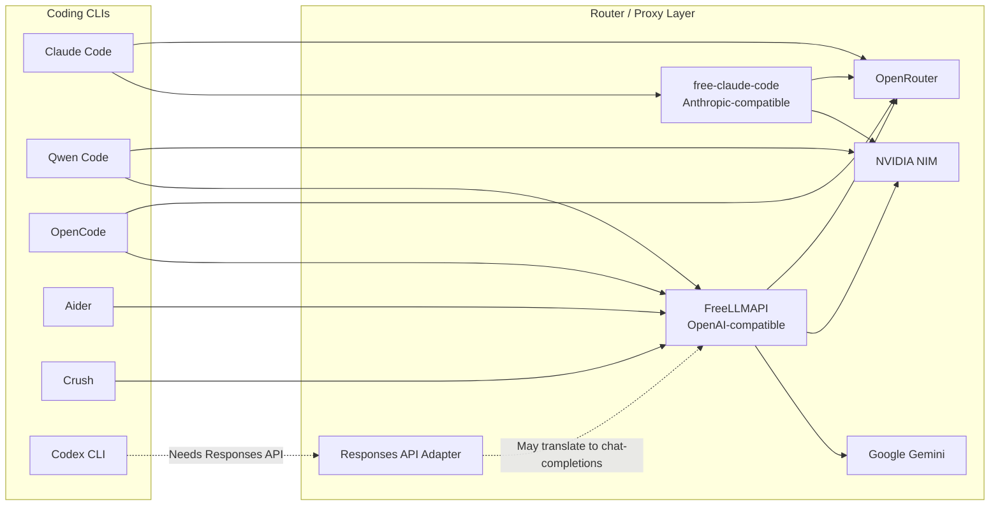

# AI Coding CLI Free Router Guide


Huong dan thuc dung de test va dung nhieu AI coding CLI voi cac provider co free tier nhu OpenRouter, NVIDIA NIM, Google Gemini va cac router/proxy local.

> Muc tieu: tan dung free token mot cach co kiem soat, khong paste API key vao chat, GitHub issue, README, commit hay log public.

## About This Guide

Bai viet nay duoc tao trong qua trinh dung Codex de test nhanh cac AI coding CLI, router va provider tren mot may Windows thuc te. Mot so ket qua la smoke test va benchmark nho, khong phai benchmark chuan cong nghiep.

Muc tieu cua repo la mo ra mot tai lieu cong dong: neu ban da tung test Claude Code, Codex CLI, Qwen Code, OpenCode, Aider, Crush, 9Router, FreeLLMAPI, free-claude-code, LiteLLM, OpenRouter, NVIDIA NIM, Gemini hoac cac provider/router khac, hay mo issue hoac pull request de bo sung kinh nghiem.

Nhung dong gop huu ich nhat:

- Cau hinh da test chay that.
- Model nao co tool-calling on dinh.
- Loi thuong gap va cach sua.
- Provider nao bi rate limit, timeout, hoac khong hop voi agent CLI.
- Router/proxy moi ma guide chua co.
- Ket qua benchmark tren repo/codebase thuc te.

## Tool Map



## Quick Pick

| Goal | Recommended Stack | Why |
| --- | --- | --- |
| Claude Code with free/cheap providers | Claude Code + free-claude-code | Claude Code expects Anthropic Messages API; this proxy translates to NIM/OpenRouter/local models. |
| Many free-tier keys behind one endpoint | FreeLLMAPI | One local OpenAI-compatible `/v1/chat/completions` endpoint with fallback routing. |
| Direct NVIDIA NIM smoke test | Qwen Code + NVIDIA NIM | Qwen Code supports `--openai-base-url` directly. |
| OpenRouter-first workflow | OpenCode or Aider + OpenRouter | Both are practical for OpenAI-compatible provider workflows. |
| Codex CLI custom providers | Use only providers/adapters with Responses API | Recent Codex CLI builds prefer `/v1/responses`; plain chat-completions routers may fail. |

## Security First

Never paste real API keys into:

- GitHub README, issue, pull request, gist, screenshot, terminal recording, or blog post.
- Chat transcripts or AI assistant messages.
- `.env.example`, `config.toml`, shell history examples, or benchmark logs.

Use environment variables locally:

```powershell
$env:OPENROUTER_API_KEY="sk-or-v1-REPLACE_ME"
$env:NVIDIA_API_KEY="nvapi-REPLACE_ME"
$env:GEMINI_API_KEY="AIzaSyREPLACE_ME"
$env:ANTHROPIC_API_KEY="REPLACE_ME"
```

If a key was pasted into a chat, terminal log, Git commit, or public issue, treat it as leaked and rotate it.

## Prerequisites

- Windows PowerShell examples are used below.
- Node.js 20+ for FreeLLMAPI, Qwen Code, OpenCode, Crush.
- Python 3.14+ and `uv` for free-claude-code local.
- Claude Code installed if testing Claude workflows.
- Git installed if cloning repositories.

## 1. Claude Code via Remote Claude Proxy

This is the fastest test path when you already have a compatible proxy URL and token.

```powershell
$env:ANTHROPIC_API_KEY="REPLACE_ME"
$env:ANTHROPIC_BASE_URL="https://cc.freemodel.dev"
$env:CLAUDE_CODE_DISABLE_NONESSENTIAL_TRAFFIC="1"

claude --bare --print --no-session-persistence --model "claude-sonnet-4-6" -- "Reply with exactly OK."
```

Run an agent task:

```powershell
claude --bare --print --no-session-persistence `
  --model "claude-sonnet-4-6" `
  --permission-mode bypassPermissions `
  -- "Fix the failing tests, run the tests, and report the result."
```

## 2. Claude Code via Local free-claude-code

Repository: <https://github.com/Alishahryar1/free-claude-code>

```powershell
cd C:\Users\ADMIN\Desktop
git clone https://github.com/Alishahryar1/free-claude-code.git
cd free-claude-code
Copy-Item .env.example .env
```

Edit `.env` locally:

```env
NVIDIA_NIM_API_KEY="REPLACE_ME"
OPENROUTER_API_KEY="REPLACE_ME"

MODEL="nvidia_nim/qwen/qwen3-coder-480b-a35b-instruct"
ANTHROPIC_AUTH_TOKEN="freecc"
FCC_OPEN_BROWSER=false
```

Start the local proxy:

```powershell
uv run uvicorn server:app --host 127.0.0.1 --port 8082
```

Point Claude Code at it:

```powershell
$env:ANTHROPIC_AUTH_TOKEN="freecc"
$env:ANTHROPIC_BASE_URL="http://127.0.0.1:8082"
$env:CLAUDE_CODE_DISABLE_NONESSENTIAL_TRAFFIC="1"

claude --model sonnet
```

## 3. FreeLLMAPI for OpenAI-Compatible CLIs

Repository: <https://github.com/tashfeenahmed/freellmapi>

FreeLLMAPI exposes:

```text
http://127.0.0.1:3001/v1/chat/completions
```

Clone and install:

```powershell
cd C:\Users\ADMIN\Desktop
git clone https://github.com/tashfeenahmed/freellmapi.git
cd freellmapi
npm install
Copy-Item .env.example .env
```

Generate an encryption key:

```powershell
node -e "console.log(require('crypto').randomBytes(32).toString('hex'))"
```

Put the generated value into `.env`:

```env
ENCRYPTION_KEY=REPLACE_WITH_64_CHAR_HEX
PORT=3001
```

Run server and dashboard:

```powershell
npm run dev
```

Open the dashboard:

```text
http://localhost:5173
```

Add provider keys in the dashboard, then copy the generated unified key. Use it as the OpenAI-compatible API key for clients.

## 4. Qwen Code

Direct NVIDIA NIM:

```powershell
npx --yes @qwen-code/qwen-code `
  --bare `
  --auth-type openai `
  --openai-api-key "$env:NVIDIA_API_KEY" `
  --openai-base-url "https://integrate.api.nvidia.com/v1" `
  --model "qwen/qwen3-coder-480b-a35b-instruct" `
  --approval-mode yolo `
  --prompt "Reply with exactly OK."
```

Via FreeLLMAPI:

```powershell
npx --yes @qwen-code/qwen-code `
  --bare `
  --auth-type openai `
  --openai-api-key "$env:FREELLMAPI_API_KEY" `
  --openai-base-url "http://127.0.0.1:3001/v1" `
  --model "auto" `
  --approval-mode yolo `
  --prompt "Fix the failing tests and run npm test."
```

## 5. OpenCode

OpenRouter native:

```powershell
$env:OPENROUTER_API_KEY="REPLACE_ME"

npx --yes opencode-ai run `
  --pure `
  --model "openrouter/qwen/qwen3-coder:free" `
  -- "Reply with exactly OK."
```

If a free OpenRouter model times out or rate-limits, switch model or use FreeLLMAPI fallback routing.

## 6. Aider

OpenRouter:

```powershell
pip install aider-chat

$env:OPENAI_API_KEY="$env:OPENROUTER_API_KEY"
$env:OPENAI_API_BASE="https://openrouter.ai/api/v1"

aider --model openai/qwen/qwen3-coder:free
```

FreeLLMAPI:

```powershell
$env:OPENAI_API_KEY="$env:FREELLMAPI_API_KEY"
$env:OPENAI_API_BASE="http://127.0.0.1:3001/v1"

aider --model openai/auto
```

## 7. Crush

Repository/package: <https://github.com/charmbracelet/crush>

```powershell
npx --yes @charmland/crush --help
```

Crush is useful when you want a polished terminal UI and multi-provider setup. Configure it with a provider that supports your preferred model and tool-calling behavior.

## 8. Codex CLI Notes

Recent Codex CLI versions can accept custom providers, but many builds prefer the OpenAI Responses API:

```text
/v1/responses
```

Most free routers expose only:

```text
/v1/chat/completions
```

That means this may fail:

```text
Codex CLI -> NVIDIA NIM direct
Codex CLI -> FreeLLMAPI direct
```

Use Codex with:

- Native OpenAI/Codex login.
- A provider/router that supports Responses API.
- A protocol adapter that translates Responses API to chat-completions.

## Benchmark Recipe

Use the same small repository and same prompt for every CLI:

```text
In this repository, fix the failing tests by editing the implementation only.
Keep the public API unchanged.
After editing, run the test command and report the result briefly.
```

Score each run:

| Metric | What To Check |
| --- | --- |
| Pass/fail | Did tests pass after the agent finished? |
| Intervention | Did you need to manually approve, restart, or fix the run? |
| Diff quality | Did it make the minimal correct edit? |
| Time | How long from prompt to passing tests? |
| Cost | Which provider served the request? |
| Tool compatibility | Did tool calls, shell commands, and edits work? |

## Known Failure Modes

| Symptom | Likely Cause | Fix |
| --- | --- | --- |
| `429 Too Many Requests` | Free provider rate limit | Wait, switch model, or add more providers to the router. |
| `/v1/responses` 404 | Chat-completions-only provider used with Codex | Use a Responses-compatible adapter/provider. |
| Tool-call error | Model does not support the CLI's tool-calling pattern | Switch to a coding/tool-capable model. |
| Proxy starts but no port opens | Dependency/runtime issue | Run foreground and inspect logs. |
| Google key visible in URL logs | Gemini API key passed as query string | Avoid sharing logs; rotate exposed keys. |

## References

- free-claude-code: <https://github.com/Alishahryar1/free-claude-code>
- FreeLLMAPI: <https://github.com/tashfeenahmed/freellmapi>
- OpenRouter: <https://openrouter.ai>
- NVIDIA NIM: <https://build.nvidia.com>
- Qwen Code: <https://www.npmjs.com/package/@qwen-code/qwen-code>
- OpenCode: <https://www.npmjs.com/package/opencode-ai>
- Crush: <https://github.com/charmbracelet/crush>
- Aider: <https://aider.chat>

## Disclaimer

Free tiers are for experimentation and personal development. Read each provider's terms. Do not resell keys, share your local proxy publicly, or treat free-tier routing as production infrastructure.
