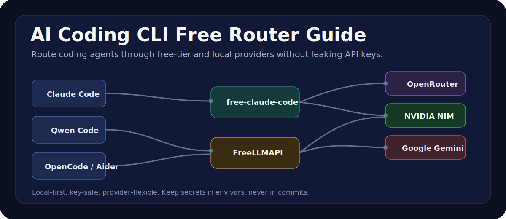
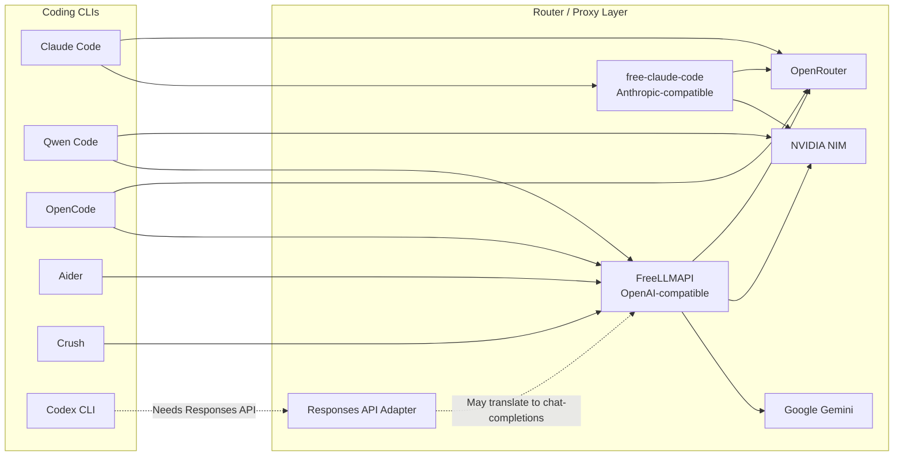

# AI Coding CLI Free Router Guide



Hướng dẫn thực dụng để test và dùng nhiều AI coding CLI với các provider có free tier như OpenRouter, NVIDIA NIM, Google Gemini và các router/proxy local.

> Mục tiêu: tận dụng free token một cách có kiểm soát, không paste API key vào chat, GitHub issue, README, commit hay log public.

## Về Bài Viết

Bài viết này được tạo trong quá trình dùng Codex để test nhanh các AI coding CLI, router và provider trên một máy Windows thực tế. Một số kết quả là smoke test và benchmark nhỏ, không phải benchmark chuẩn công nghiệp.

Mục tiêu của repo là mở ra một tài liệu cộng đồng: nếu bạn đã từng test Claude Code, Codex CLI, Qwen Code, OpenCode, Aider, Crush, 9Router, FreeLLMAPI, free-claude-code, LiteLLM, OpenRouter, NVIDIA NIM, Gemini hoặc các provider/router khác, hãy mở issue hoặc pull request để bổ sung kinh nghiệm.

Những đóng góp hữu ích nhất:

- Cấu hình đã test chạy thật.
- Model nào có tool-calling ổn định.
- Lỗi thường gặp và cách sửa.
- Provider nào bị rate limit, timeout, hoặc không hợp với agent CLI.
- Router/proxy mới mà guide chưa có.
- Kết quả benchmark trên repo/codebase thực tế.

## Tool Map



## Chọn Nhanh

| Mục Tiêu | Stack Đề Xuất | Lý Do |
| --- | --- | --- |
| Claude Code với provider miễn phí/rẻ | Claude Code + free-claude-code | Claude Code cần Anthropic Messages API; proxy này dịch request sang NIM/OpenRouter/local models. |
| Gom nhiều free-tier key sau một endpoint | FreeLLMAPI | Một endpoint local OpenAI-compatible `/v1/chat/completions` có fallback routing. |
| Smoke test NVIDIA NIM trực tiếp | Qwen Code + NVIDIA NIM | Qwen Code hỗ trợ trực tiếp `--openai-base-url`. |
| Workflow ưu tiên OpenRouter | OpenCode hoặc Aider + OpenRouter | Cả hai hợp với provider OpenAI-compatible. |
| Codex CLI custom providers | Chỉ dùng provider/adapter có Responses API | Codex CLI bản mới thường ưu tiên `/v1/responses`; router chỉ có chat-completions có thể fail. |

## Bảo Mật Trước

Không paste API key thật vào:

- GitHub README, issue, pull request, gist, screenshot, terminal recording, or blog post.
- Chat transcripts or AI assistant messages.
- `.env.example`, `config.toml`, shell history examples, or benchmark logs.

Dùng environment variables ở máy local:

```powershell
$env:OPENROUTER_API_KEY="sk-or-v1-REPLACE_ME"
$env:NVIDIA_API_KEY="nvapi-REPLACE_ME"
$env:GEMINI_API_KEY="AIzaSyREPLACE_ME"
$env:ANTHROPIC_API_KEY="REPLACE_ME"
```

Nếu một key đã bị paste vào chat, terminal log, Git commit hoặc public issue, hãy xem như key đã lộ và rotate lại.

## Chuẩn Bị

- Các ví dụ bên dưới dùng Windows PowerShell.
- Node.js 20+ for FreeLLMAPI, Qwen Code, OpenCode, Crush.
- Python 3.14+ and `uv` for free-claude-code local.
- Cài Claude Code nếu muốn test Claude workflows.
- Cài Git nếu muốn clone repositories.

## 1. Claude Code via Remote Claude Proxy

Đây là cách test nhanh nhất khi bạn đã có proxy URL và token tương thích.

```powershell
$env:ANTHROPIC_API_KEY="REPLACE_ME"
$env:ANTHROPIC_BASE_URL="https://cc.freemodel.dev"
$env:CLAUDE_CODE_DISABLE_NONESSENTIAL_TRAFFIC="1"

claude --bare --print --no-session-persistence --model "claude-sonnet-4-6" -- "Reply with exactly OK."
```

Chạy một agent task:

```powershell
claude --bare --print --no-session-persistence `
  --model "claude-sonnet-4-6" `
  --permission-mode bypassPermissions `
  -- "Fix the failing tests, run the tests, and report the result."
```

## 2. Claude Code via Local free-claude-code

Repository: <https://github.com/Alishahryar1/free-claude-code>

```powershell
cd C:\Users\ADMIN\Desktop
git clone https://github.com/Alishahryar1/free-claude-code.git
cd free-claude-code
Copy-Item .env.example .env
```

Sửa `.env` ở máy local:

```env
NVIDIA_NIM_API_KEY="REPLACE_ME"
OPENROUTER_API_KEY="REPLACE_ME"

MODEL="nvidia_nim/qwen/qwen3-coder-480b-a35b-instruct"
ANTHROPIC_AUTH_TOKEN="freecc"
FCC_OPEN_BROWSER=false
```

Start local proxy:

```powershell
uv run uvicorn server:app --host 127.0.0.1 --port 8082
```

Trỏ Claude Code vào proxy:

```powershell
$env:ANTHROPIC_AUTH_TOKEN="freecc"
$env:ANTHROPIC_BASE_URL="http://127.0.0.1:8082"
$env:CLAUDE_CODE_DISABLE_NONESSENTIAL_TRAFFIC="1"

claude --model sonnet
```

## 3. FreeLLMAPI for OpenAI-Compatible CLIs

Repository: <https://github.com/tashfeenahmed/freellmapi>

FreeLLMAPI expose endpoint:

```text
http://127.0.0.1:3001/v1/chat/completions
```

Clone và cài dependency:

```powershell
cd C:\Users\ADMIN\Desktop
git clone https://github.com/tashfeenahmed/freellmapi.git
cd freellmapi
npm install
Copy-Item .env.example .env
```

Tạo encryption key:

```powershell
node -e "console.log(require('crypto').randomBytes(32).toString('hex'))"
```

Đưa giá trị vừa tạo vào `.env`:

```env
ENCRYPTION_KEY=REPLACE_WITH_64_CHAR_HEX
PORT=3001
```

Chạy server và dashboard:

```powershell
npm run dev
```

Mở dashboard:

```text
http://localhost:5173
```

Thêm provider keys trong dashboard, sau đó copy unified key được tạo ra. Dùng key đó như OpenAI-compatible API key cho các client.

## 4. Qwen Code

NVIDIA NIM trực tiếp:

```powershell
npx --yes @qwen-code/qwen-code `
  --bare `
  --auth-type openai `
  --openai-api-key "$env:NVIDIA_API_KEY" `
  --openai-base-url "https://integrate.api.nvidia.com/v1" `
  --model "qwen/qwen3-coder-480b-a35b-instruct" `
  --approval-mode yolo `
  --prompt "Reply with exactly OK."
```

Thông qua FreeLLMAPI:

```powershell
npx --yes @qwen-code/qwen-code `
  --bare `
  --auth-type openai `
  --openai-api-key "$env:FREELLMAPI_API_KEY" `
  --openai-base-url "http://127.0.0.1:3001/v1" `
  --model "auto" `
  --approval-mode yolo `
  --prompt "Fix the failing tests and run npm test."
```

## 5. OpenCode

OpenRouter native:

```powershell
$env:OPENROUTER_API_KEY="REPLACE_ME"

npx --yes opencode-ai run `
  --pure `
  --model "openrouter/qwen/qwen3-coder:free" `
  -- "Reply with exactly OK."
```

Nếu model free của OpenRouter bị timeout hoặc rate-limit, hãy đổi model hoặc dùng fallback routing của FreeLLMAPI.

## 6. Aider

OpenRouter:

```powershell
pip install aider-chat

$env:OPENAI_API_KEY="$env:OPENROUTER_API_KEY"
$env:OPENAI_API_BASE="https://openrouter.ai/api/v1"

aider --model openai/qwen/qwen3-coder:free
```

FreeLLMAPI:

```powershell
$env:OPENAI_API_KEY="$env:FREELLMAPI_API_KEY"
$env:OPENAI_API_BASE="http://127.0.0.1:3001/v1"

aider --model openai/auto
```

## 7. Crush

Repository/package: <https://github.com/charmbracelet/crush>

```powershell
npx --yes @charmland/crush --help
```

Crush hữu ích khi bạn muốn terminal UI đẹp và setup nhiều provider. Hãy cấu hình Crush với provider hỗ trợ model và tool-calling phù hợp với workflow của bạn.

## 8. Codex CLI Notes

Các bản Codex CLI gần đây có thể nhận custom provider, nhưng nhiều build ưu tiên OpenAI Responses API:

```text
/v1/responses
```

Phần lớn free router chỉ expose:

```text
/v1/chat/completions
```

Nghĩa là các cấu hình sau có thể fail:

```text
Codex CLI -> NVIDIA NIM direct
Codex CLI -> FreeLLMAPI direct
```

Dùng Codex với:

- Native OpenAI/Codex login.
- Provider/router có hỗ trợ Responses API.
- Protocol adapter dịch Responses API sang chat-completions.

## Công Thức Benchmark

Dùng cùng một repo nhỏ và cùng một prompt cho mọi CLI:

```text
In this repository, fix the failing tests by editing the implementation only.
Keep the public API unchanged.
After editing, run the test command and report the result briefly.
```

Chấm điểm mỗi lần chạy:

| Tiêu Chí | Cần Kiểm Tra |
| --- | --- |
| Pass/fail | Test có pass sau khi agent chạy xong không? |
| Can thiệp | Có phải approve, restart hoặc sửa tay không? |
| Chất lượng diff | Agent có sửa đúng và tối thiểu không? |
| Thời gian | Từ lúc prompt đến khi test pass mất bao lâu? |
| Chi phí | Provider nào đã serve request? |
| Tương thích tool | Tool calls, shell commands và file edits có hoạt động không? |

## Lỗi Thường Gặp

| Triệu Chứng | Nguyên Nhân Có Thể | Cách Sửa |
| --- | --- | --- |
| `429 Too Many Requests` | Provider free-tier bị rate limit | Chờ, đổi model, hoặc thêm provider vào router. |
| `/v1/responses` 404 | Dùng provider chỉ có chat-completions với Codex | Dùng adapter/provider tương thích Responses API. |
| Tool-call error | Model không hỗ trợ pattern tool-calling của CLI | Đổi sang model có khả năng coding/tool-use tốt hơn. |
| Proxy start nhưng không mở port | Lỗi dependency/runtime | Chạy foreground và đọc log. |
| Google key xuất hiện trong URL logs | Gemini API key được truyền qua query string | Không chia sẻ log; rotate key đã lộ. |

## References

- free-claude-code: <https://github.com/Alishahryar1/free-claude-code>
- FreeLLMAPI: <https://github.com/tashfeenahmed/freellmapi>
- OpenRouter: <https://openrouter.ai>
- NVIDIA NIM: <https://build.nvidia.com>
- Qwen Code: <https://www.npmjs.com/package/@qwen-code/qwen-code>
- OpenCode: <https://www.npmjs.com/package/opencode-ai>
- Crush: <https://github.com/charmbracelet/crush>
- Aider: <https://aider.chat>

## Lưu Ý

Free tier phù hợp cho thử nghiệm và phát triển cá nhân. Hãy đọc điều khoản của từng provider. Không bán lại key, không public local proxy, và không xem free-tier routing là hạ tầng production.
