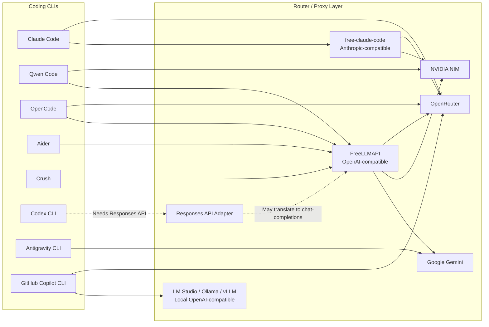

# AI Coding CLI Free Router Guide


Hướng dẫn thực dụng để test và dùng nhiều AI coding CLI với các provider có free tier như OpenRouter, NVIDIA NIM, Google Gemini và các router/proxy local.

> Mục tiêu: tận dụng free token một cách có kiểm soát, không paste API key vào chat, GitHub issue, README, commit hay log public.

## Responsible Use

Repo này chỉ phục vụ mục đích học tập, thử nghiệm cá nhân và đánh giá kỹ thuật. Không dùng hướng dẫn này để né billing, vượt rate limit, tạo nhiều tài khoản nhằm lạm dụng free tier, chia sẻ API key, bán lại quyền truy cập, hoặc public proxy cho người khác sử dụng.

Trước khi dùng provider nào, hãy đọc điều khoản của provider đó. Một số free tier hoặc trial credit, ví dụ NVIDIA NIM trial/free credit, có thể chỉ dành cho mục đích evaluation. Nếu bạn muốn dùng cho công việc nghiêm túc, team hoặc production, hãy dùng plan/API chính thức phù hợp.

Nguyên tắc an toàn:

- Chỉ chạy router/proxy trên `127.0.0.1` hoặc mạng private bạn kiểm soát.
- Không expose local proxy ra internet.
- Không chia sẻ unified API key hoặc upstream API key.
- Không dùng free tier như backend production.
- Tôn trọng rate limit và chính sách sử dụng của từng provider.

## Về Bài Viết

Bài viết này được tạo trong quá trình dùng Codex để test nhanh các AI coding CLI, router và provider trên một máy Windows thực tế. Một số kết quả là smoke test và benchmark nhỏ, không phải benchmark chuẩn công nghiệp.

Nếu muốn phần tư duy dài hơn về vì sao nên chuyển từ crack sang API/open-source/local-cloud hybrid, đọc thêm: [Thời Của Crack Đã Chết](crack-api-open-source-hybrid.md).

Mục tiêu của repo là mở ra một tài liệu cộng đồng: nếu bạn đã từng test Claude Code, Codex CLI, Antigravity CLI, GitHub Copilot CLI, Qwen Code, OpenCode, Aider, Crush, 9Router, FreeLLMAPI, free-claude-code, LiteLLM, OpenRouter, NVIDIA NIM, Gemini hoặc các provider/router khác, hãy mở issue hoặc pull request để bổ sung kinh nghiệm.

Những đóng góp hữu ích nhất:

- Cấu hình đã test chạy thật.
- Model nào có tool-calling ổn định.
- Lỗi thường gặp và cách sửa.
- Provider nào bị rate limit, timeout, hoặc không hợp với agent CLI.
- Router/proxy mới mà guide chưa có.
- Kết quả benchmark trên repo/codebase thực tế.

## Tool Map



## Chọn Nhanh

| Mục Tiêu | Stack Đề Xuất | Lý Do |
| --- | --- | --- |
| Claude Code với provider miễn phí/rẻ | Claude Code + free-claude-code | Claude Code cần Anthropic Messages API; proxy này dịch request sang NIM/OpenRouter/local models. |
| Gom nhiều free-tier key sau một endpoint | FreeLLMAPI | Một endpoint local OpenAI-compatible `/v1/chat/completions` có fallback routing. |
| Smoke test NVIDIA NIM trực tiếp | Qwen Code + NVIDIA NIM | Qwen Code hỗ trợ trực tiếp `--openai-base-url`. |
| Workflow ưu tiên OpenRouter | OpenCode hoặc Aider + OpenRouter | Cả hai hợp với provider OpenAI-compatible. |
| Codex CLI custom providers | Chỉ dùng provider/adapter có Responses API | Codex CLI bản mới thường ưu tiên `/v1/responses`; router chỉ có chat-completions có thể fail. |
| Terminal agent Google mới | Antigravity CLI | Google đang chuyển hướng người dùng Gemini CLI cá nhân/free sang Antigravity CLI. |
| Copilot terminal agent mới | GitHub Copilot CLI mới (`@github/copilot`) | Khác với `gh-copilot`/GitHub Next CLI cũ; có agent workflow, MCP/plugins/skills và hỗ trợ BYOK/local models. |
| Combo local đã test | LM Studio + Open WebUI + Qwen3-14B Q5_K_M + Codex/CLI | Dùng tốt để học local LLM và code prompt; web search trong Open WebUI phải bật theo từng lượt. |

## Bảo Mật Trước

Không paste API key thật vào:

- GitHub README, issue, pull request, gist, screenshot, terminal recording, or blog post.
- Chat transcripts or AI assistant messages.
- `.env.example`, `config.toml`, shell history examples, or benchmark logs.

Dùng environment variables ở máy local:

```powershell
$env:OPENROUTER_API_KEY="sk-or-v1-REPLACE_ME"
$env:NVIDIA_API_KEY="nvapi-REPLACE_ME"
$env:GEMINI_API_KEY="AIzaSyREPLACE_ME"
$env:ANTHROPIC_API_KEY="REPLACE_ME"
```

Nếu một key đã bị paste vào chat, terminal log, Git commit hoặc public issue, hãy xem như key đã lộ và rotate lại.

## Chuẩn Bị

- Các ví dụ bên dưới dùng Windows PowerShell.
- Node.js 20+ for FreeLLMAPI, Qwen Code, OpenCode, Crush.
- Python 3.10+ cho Aider; Python 3.14+ and `uv` for free-claude-code local.
- Cài Claude Code nếu muốn test Claude workflows.
- Cài Git nếu muốn clone repositories.

## Kiểm Tra CLI Thật Trước Khi Test

Codex, GitHub connector, MCP hoặc môi trường sandbox có thể test được một số bước mà không chứng minh CLI tương ứng đã được cài global trên máy. Trước khi chạy từng phần, hãy kiểm tra CLI thật trong PowerShell:

```powershell
Get-Command git -ErrorAction SilentlyContinue
Get-Command node -ErrorAction SilentlyContinue
Get-Command npx -ErrorAction SilentlyContinue
Get-Command py -ErrorAction SilentlyContinue
Get-Command python -ErrorAction SilentlyContinue
Get-Command aider -ErrorAction SilentlyContinue
Get-Command claude -ErrorAction SilentlyContinue
Get-Command agy -ErrorAction SilentlyContinue
Get-Command copilot -ErrorAction SilentlyContinue
```

Kiểm tra version:

```powershell
git --version
node --version
npx --version
py --version
py -m pip --version
aider --version
claude --version
agy --version
copilot --version
```

Nếu `python` không có nhưng `py` có, dùng `py -m pip ...` thay cho `pip ...` trên Windows. Nếu `aider --version` báo không tìm thấy, nghĩa là Aider chưa được cài hoặc thư mục script của Python chưa nằm trong `PATH`.

Các lệnh dùng `npx --yes ...` có thể tải và chạy package tạm thời nếu máy đã có Node.js, nên không cần cài global trước. Ngược lại, Aider cần cài package Python thật trước khi gọi lệnh `aider`.

## 1. Claude Code via Remote Claude Proxy

Đây là cách test nhanh nhất khi bạn đã có proxy URL và token tương thích.

```powershell
$env:ANTHROPIC_API_KEY="REPLACE_ME"
$env:ANTHROPIC_BASE_URL="https://cc.freemodel.dev"
$env:CLAUDE_CODE_DISABLE_NONESSENTIAL_TRAFFIC="1"

claude --bare --print --no-session-persistence --model "claude-sonnet-4-6" -- "Reply with exactly OK."
```

Chạy một agent task:

```powershell
claude --bare --print --no-session-persistence `
  --model "claude-sonnet-4-6" `
  --permission-mode bypassPermissions `
  -- "Fix the failing tests, run the tests, and report the result."
```

## 2. Claude Code via Local free-claude-code

Repository: <https://github.com/Alishahryar1/free-claude-code>

```powershell
cd C:\Users\ADMIN\Desktop
git clone https://github.com/Alishahryar1/free-claude-code.git
cd free-claude-code
Copy-Item .env.example .env
```

Sửa `.env` ở máy local:

```env
NVIDIA_NIM_API_KEY="REPLACE_ME"
OPENROUTER_API_KEY="REPLACE_ME"

MODEL="nvidia_nim/qwen/qwen3-coder-480b-a35b-instruct"
ANTHROPIC_AUTH_TOKEN="freecc"
FCC_OPEN_BROWSER=false
```

Start local proxy:

```powershell
uv run uvicorn server:app --host 127.0.0.1 --port 8082
```

Trỏ Claude Code vào proxy:

```powershell
$env:ANTHROPIC_AUTH_TOKEN="freecc"
$env:ANTHROPIC_BASE_URL="http://127.0.0.1:8082"
$env:CLAUDE_CODE_DISABLE_NONESSENTIAL_TRAFFIC="1"

claude --model sonnet
```

## 3. FreeLLMAPI for OpenAI-Compatible CLIs

Repository: <https://github.com/tashfeenahmed/freellmapi>

FreeLLMAPI expose endpoint:

```text
http://127.0.0.1:3001/v1/chat/completions
```

Clone và cài dependency:

```powershell
cd C:\Users\ADMIN\Desktop
git clone https://github.com/tashfeenahmed/freellmapi.git
cd freellmapi
npm install
Copy-Item .env.example .env
```

Tạo encryption key:

```powershell
node -e "console.log(require('crypto').randomBytes(32).toString('hex'))"
```

Đưa giá trị vừa tạo vào `.env`:

```env
ENCRYPTION_KEY=REPLACE_WITH_64_CHAR_HEX
PORT=3001
```

Chạy server và dashboard:

```powershell
npm run dev
```

Mở dashboard:

```text
http://localhost:5173
```

Thêm provider keys trong dashboard, sau đó copy unified key được tạo ra. Dùng key đó như OpenAI-compatible API key cho các client.

Chỉ dán raw key vào dashboard, không dán cả lệnh PowerShell. Ví dụ đúng là `sk-or-v1-...`, `nvapi-...`, `AIza...`; ví dụ sai là `$env:OPENROUTER_API_KEY="sk-or-v1-..."`.

Smoke test trực tiếp router:

```powershell
$env:FREELLMAPI_API_KEY="freellmapi-REPLACE_ME"

$body = @{
  model = "auto"
  messages = @(@{ role = "user"; content = "Reply with exactly OK." })
  temperature = 0
  max_tokens = 80
} | ConvertTo-Json -Depth 10

Invoke-WebRequest `
  -Uri "http://127.0.0.1:3001/v1/chat/completions" `
  -Method Post `
  -Headers @{ Authorization = "Bearer $env:FREELLMAPI_API_KEY"; "Content-Type" = "application/json" } `
  -Body $body
```

Với smoke test router, tiêu chí chính là HTTP `200` và header `X-Routed-Via` cho biết provider/model đã serve request. Nội dung có thể không đúng chính xác `OK` nếu router chọn model reasoning hoặc model free đang bị fallback.

## 4. Antigravity CLI

Google đã công bố Antigravity CLI như terminal-first surface mới cho Antigravity agents. Theo thông báo chuyển đổi của Google, Gemini CLI và Gemini Code Assist IDE extensions cho người dùng Google AI Pro/Ultra và người dùng free cá nhân sẽ ngừng serve requests từ ngày 2026-06-18. Vì vậy guide này không khuyến nghị bắt đầu workflow mới trên Gemini CLI cá nhân/free; hãy chuyển sang Antigravity CLI.

Install trên Windows PowerShell:

```powershell
irm https://antigravity.google/cli/install.ps1 | iex
```

Install trên macOS/Linux:

```bash
curl -fsSL https://antigravity.google/cli/install.sh | bash
```

Chạy lần đầu:

```powershell
agy
```

Nếu bạn đã dùng Gemini CLI trước đó, Antigravity CLI có migration path cho extensions/plugins:

```powershell
agy plugin import gemini
```

Ghi chú cấu hình:

- Settings của Antigravity CLI nằm trong `~/.gemini/antigravity-cli/settings.json`.
- MCP servers dùng file `mcp_config.json`; remote MCP dùng field `serverUrl` thay vì `url`.
- Antigravity CLI đọc context/rules từ `GEMINI.md` và `AGENTS.md`, nên repo cũ có thể giữ file hướng dẫn agent.
- Đây là hướng đi nên test thay cho Gemini CLI path cũ, đặc biệt nếu cần subagents, skills, plugins và MCP.

## 5. GitHub Copilot CLI mới

Không nhầm GitHub Copilot CLI mới với các đường cũ:

- `@githubnext/github-copilot-cli`: GitHub Next technical preview cũ, không nên dùng cho workflow mới.
- `gh-copilot` extension / `gh copilot explain|suggest`: extension cũ đã được GitHub thông báo deprecate, thay bằng Copilot CLI agentic mới.
- `@github/copilot`: package hiện tại cho GitHub Copilot CLI mới.

Install trên Windows:

```powershell
winget install GitHub.Copilot
```

Hoặc dùng npm nếu đã có Node.js 22+:

```powershell
npm install -g @github/copilot
```

Chạy lần đầu:

```powershell
copilot
```

Trong CLI:

```text
/login
/init
/model
/diff
/review
```

Điểm đáng chú ý cho repo này: GitHub công bố Copilot CLI hỗ trợ BYOK và local models. Có thể cấu hình Azure OpenAI, Anthropic hoặc OpenAI-compatible endpoint, gồm cả local models như Ollama, vLLM, Foundry Local. Model cần hỗ trợ tool calling và streaming; GitHub khuyến nghị context lớn cho kết quả tốt.

Với combo local đã test ở máy Windows này, hướng thử hợp lý là:

```powershell
$env:COPILOT_PROVIDER_BASE_URL="http://127.0.0.1:1234/v1"
$env:COPILOT_PROVIDER_TYPE="openai"
$env:COPILOT_PROVIDER_API_KEY="lm-studio"
$env:COPILOT_MODEL="qwen3-14b-q5"
copilot
```

Chạy lệnh này để xem cấu hình provider hiện tại:

```powershell
copilot help providers
```

Ghi chú thực dụng:

- Nếu bạn chỉ cần command suggestion đơn giản, extension cũ có thể từng đủ dùng, nhưng workflow agentic mới nên dùng `copilot`.
- Nếu cần local/offline hoặc tự kiểm soát chi phí model, ưu tiên test BYOK/local model thay vì phụ thuộc hoàn toàn GitHub-hosted routing.
- Nếu tổ chức/tài khoản chặn Copilot CLI policy, CLI sẽ không chạy dù bạn cài đúng.

## 6. Qwen Code

NVIDIA NIM trực tiếp:

```powershell
npx --yes @qwen-code/qwen-code `
  --bare `
  --auth-type openai `
  --openai-api-key "$env:NVIDIA_API_KEY" `
  --openai-base-url "https://integrate.api.nvidia.com/v1" `
  --model "qwen/qwen3-coder-480b-a35b-instruct" `
  --approval-mode yolo `
  --prompt "Reply with exactly OK."
```

Thông qua FreeLLMAPI:

```powershell
npx --yes @qwen-code/qwen-code `
  --bare `
  --auth-type openai `
  --openai-api-key "$env:FREELLMAPI_API_KEY" `
  --openai-base-url "http://127.0.0.1:3001/v1" `
  --model "auto" `
  --approval-mode yolo `
  --prompt "Fix the failing tests and run npm test."
```

Ghi chú test thực tế: Qwen Code `0.16.0` gửi `messages[].content` dạng OpenAI content-parts array. FreeLLMAPI hiện chỉ nhận string content trong `/v1/chat/completions`, nên đường `Qwen Code -> FreeLLMAPI` có thể fail với `400 Invalid request: Invalid input`. Đường `Qwen Code -> NVIDIA NIM direct` đã smoke test OK với model `qwen/qwen3-coder-480b-a35b-instruct`.

## 7. OpenCode

OpenCode dùng model id theo provider đã cấu hình. Nếu dùng FreeLLMAPI local, thêm provider vào `C:\Users\ADMIN\.config\opencode\opencode.json`:

```json
{
  "provider": {
    "freellmapi": {
      "npm": "@ai-sdk/openai-compatible",
      "options": {
        "baseURL": "http://127.0.0.1:3001/v1",
        "apiKey": "freellmapi-REPLACE_ME"
      },
      "models": {
        "gemini-2.5-flash": {
          "name": "Gemini 2.5 Flash via FreeLLMAPI"
        }
      }
    }
  }
}
```

Test:

```powershell
npx --yes opencode-ai models freellmapi --verbose

npx --yes opencode-ai run `
  --format json `
  --model "freellmapi/gemini-2.5-flash" `
  -- "Reply with exactly OK."
```

Nếu output terminal chỉ hiện event JSON hoặc dòng trạng thái, export session để xem phần trả lời:

```powershell
npx --yes opencode-ai export SESSION_ID
```

OpenRouter native chỉ chạy nếu provider/model đã được OpenCode nhận trong `opencode-ai models`:

```powershell
$env:OPENROUTER_API_KEY="REPLACE_ME"

npx --yes opencode-ai run `
  --pure `
  --model "openrouter/qwen/qwen3-coder:free" `
  -- "Reply with exactly OK."
```

Ghi chú test thực tế: model free của OpenRouter có thể trả `429 rate-limited`. Với FreeLLMAPI, tránh `auto` khi cần smoke test ổn định; dùng model cụ thể như `freellmapi/gemini-2.5-flash`.

## 8. Aider

Cài thật trên Windows. Nếu máy có Python 3.12, dùng `uv` để tránh pip chọn bản Aider cũ trên Python 3.14:

```powershell
uv tool install --force --python 3.12 --with pip aider-chat@latest
aider --version
```

Nếu không dùng `uv`, thử pip với Python 3.12:

```powershell
py -3.12 -m pip install --user aider-chat
aider --version
```

Ghi chú test thực tế: `py -m pip install aider-chat` trên Python 3.14 có thể chỉ thấy `aider-chat 0.16.0` và fail build dependency. Dùng Python 3.12/`uv` đã cài được Aider `0.86.2`.

OpenRouter smoke test:

```powershell
$env:OPENROUTER_API_KEY="REPLACE_ME"

$env:OPENAI_API_KEY="$env:OPENROUTER_API_KEY"
$env:OPENAI_API_BASE="https://openrouter.ai/api/v1"

aider --model openai/qwen/qwen3-coder:free
```

FreeLLMAPI smoke test:

```powershell
$env:FREELLMAPI_API_KEY="REPLACE_ME"

$env:OPENAI_API_KEY="$env:FREELLMAPI_API_KEY"
$env:OPENAI_API_BASE="http://127.0.0.1:3001/v1"

aider --model openai/auto
```

Ghi chú: FreeLLMAPI phải đang chạy ở `http://127.0.0.1:3001` và unified key phải được tạo trong dashboard trước. OpenRouter cần key thật có quyền gọi model đã chọn; model free có thể bị rate limit hoặc timeout. Aider qua FreeLLMAPI đã smoke test OK với `openai/auto`.

## 9. Crush

Repository/package: <https://github.com/charmbracelet/crush>

```powershell
npx --yes @charmland/crush --help
```

Crush hữu ích khi bạn muốn terminal UI đẹp và setup nhiều provider. Hãy cấu hình Crush với provider hỗ trợ model và tool-calling phù hợp với workflow của bạn.

Ghi chú test thực tế: trỏ Crush vào FreeLLMAPI bằng `OPENAI_API_KEY` và `OPENAI_API_ENDPOINT=http://127.0.0.1:3001/v1` chưa chạy được vì Crush gọi `/v1/responses`, còn FreeLLMAPI hiện chỉ expose `/v1/chat/completions`. Cần provider có Responses API hoặc adapter Responses -> chat-completions.

## 10. Codex CLI Notes

Các bản Codex CLI gần đây có thể nhận custom provider, nhưng nhiều build ưu tiên OpenAI Responses API:

```text
/v1/responses
```

Phần lớn free router chỉ expose:

```text
/v1/chat/completions
```

Nghĩa là các cấu hình sau có thể fail:

```text
Codex CLI -> NVIDIA NIM direct
Codex CLI -> FreeLLMAPI direct
```

Dùng Codex với:

- Native OpenAI/Codex login.
- Provider/router có hỗ trợ Responses API.
- Protocol adapter dịch Responses API sang chat-completions.

## 11. Combo Local Đã Test: LM Studio + Open WebUI + Qwen3

Mục tiêu combo này không phải thay ChatGPT realtime, mà là hiểu cách dựng local core để code/chat riêng tư hơn, giảm phụ thuộc cloud và kiểm soát chi phí.

Stack đã test trên Windows:

| Thành Phần | Vai Trò | Ghi Chú Thực Tế |
| --- | --- | --- |
| LM Studio | Chạy model local và expose OpenAI-compatible API | Endpoint `http://127.0.0.1:1234/v1`. |
| Qwen3-14B Q5_K_M | Model local coding/chat | Chạy được trên máy 32GB RAM / 12GB VRAM, nhưng chưa thật mượt; Q4_K_M có thể nhẹ hơn. |
| Gemma 4 31B GGUF | Model local để thử thêm | Với máy 32GB RAM / 12GB VRAM, nên thử Q3_K_M trước; Q4_K_M nặng hơn. |
| Open WebUI | Giao diện web cho local model | Chạy bằng Docker ở `http://127.0.0.1:3000`. |
| Docker Desktop | Chạy Open WebUI container | Không bắt buộc cho LM Studio, nhưng tiện để chạy WebUI gọn. |
| Aider/OpenCode/Codex/CLI | Dùng cho code workflow thật | WebUI hợp chat; code workflow nên để CLI/agent sửa file và chạy test. |

Start script mẫu:

```powershell
& "C:\Users\ADMIN\Desktop\start-local-ai-stack.ps1"
```

Kiểm tra LM Studio API:

```powershell
Invoke-RestMethod -Uri "http://127.0.0.1:1234/v1/models" | ConvertTo-Json -Depth 5
```

Prompt nhanh với Qwen3:

```text
/no_think viết hàm JavaScript tính tổng mảng số, kèm ví dụ ngắn
```

Lưu ý quan trọng về realtime/web search:

- Model local không tự biết giá vàng, thời tiết, tin mới.
- Trong Open WebUI, `ENABLE_WEB_SEARCH=true` chỉ bật khả năng có toggle Web Search; mỗi lượt chat vẫn phải bật nút Web Search/Tools trong UI.
- Nếu database chat lưu `features=None`, lượt chat đó không hề chạy web search dù prompt có chữ "hôm nay".
- DuckDuckGo trong container có thể search được, nhưng pipeline chỉ chạy khi request có `features.web_search=true`.
- Qwen3 có thinking mode; dùng `/no_think` cho câu hỏi nhanh hoặc câu code ngắn.

File script đang dùng nên giữ các điểm này:

```powershell
$lms = "$env:LOCALAPPDATA\Programs\LM Studio\resources\app\.webpack\lms.exe"
& $lms load qwen3-14b --gpu max -c 12288 --parallel 1 --identifier qwen3-14b-q5 -y

docker run -d --name open-webui --restart unless-stopped `
  -p 3000:8080 `
  --add-host=host.docker.internal:host-gateway `
  -e WEBUI_AUTH=false `
  -e ENABLE_OLLAMA_API=false `
  -e ENABLE_OPENAI_API=true `
  -e OPENAI_API_BASE_URL=http://host.docker.internal:1234/v1 `
  -e OPENAI_API_KEY=lm-studio `
  -e TASK_MODEL_EXTERNAL=qwen3-14b-q5 `
  -e ENABLE_WEB_SEARCH=true `
  -e WEB_SEARCH_ENGINE=duckduckgo `
  -e WEB_SEARCH_RESULT_COUNT=3 `
  -e BYPASS_WEB_SEARCH_EMBEDDING_AND_RETRIEVAL=true `
  -e WEB_LOADER_CONCURRENT_REQUESTS=2 `
  -v open-webui:/app/backend/data `
  ghcr.io/open-webui/open-webui:main
```

### 11.1. Dùng Local Model Để Code Bằng Aider

Aider là đường dễ test nhất với local OpenAI-compatible endpoint vì chỉ cần trỏ `OPENAI_API_BASE` về LM Studio.

Chạy trong thư mục repo thật, không chạy từ `C:\Windows\System32`:

```powershell
cd C:\Users\ADMIN\Desktop\local-ai-code-test
$env:OPENAI_API_KEY = "lm-studio"
$env:OPENAI_API_BASE = "http://127.0.0.1:1234/v1"
aider --model openai/qwen3-14b-q5 --no-auto-commits --no-gitignore --yes-always
```

Smoke test đã chạy:

```powershell
aider --model openai/qwen3-14b-q5 --no-auto-commits --no-gitignore --yes-always --test-cmd "npm test" --auto-test --message "The tests fail because src/arrayUtils.mjs is missing. Implement the minimal sumEvenNumbers function so npm test passes. Do not change tests." test/arrayUtils.test.mjs
```

Kết quả thực tế: Aider tạo `src/arrayUtils.mjs` và `npm test` pass `7/7`.

Lưu ý riêng với Qwen3: không đặt `/no_think` ở đầu message cho Aider, vì Aider hiểu chuỗi bắt đầu bằng `/` là lệnh nội bộ.

### 11.2. Dùng Local Model Để Code Bằng OpenCode

OpenCode cần khai báo provider riêng trong:

```text
C:\Users\ADMIN\.config\opencode\opencode.json
```

Provider đã test:

```json
{
  "provider": {
    "lmstudio-local": {
      "npm": "@ai-sdk/openai-compatible",
      "options": {
        "baseURL": "http://127.0.0.1:1234/v1",
        "apiKey": "lm-studio"
      },
      "models": {
        "qwen3-14b-q5": {
          "name": "Qwen3 14B Q5 via LM Studio"
        }
      }
    }
  }
}
```

Không dùng provider id `lmstudio` nếu bản OpenCode của bạn đã có built-in provider cùng tên, vì nó có thể trỏ sang URL khác. Dùng `lmstudio-local` để tránh đụng tên.

Kiểm tra model:

```powershell
npx --yes opencode-ai models lmstudio-local --verbose
```

Chạy task code một lượt:

```powershell
cd C:\Users\ADMIN\Desktop\local-ai-code-test
npx --yes opencode-ai run --model "lmstudio-local/qwen3-14b-q5" --dangerously-skip-permissions -- "The tests fail because src/arrayUtils.mjs is missing. Implement the minimal sumEvenNumbers function so npm test passes. Do not change tests. After editing, run npm test."
```

Kết quả thực tế: OpenCode sửa file, chạy `npm test`, pass `7/7`.

Lưu ý quan trọng: lần đầu OpenCode có thể fail kiểu `n_keep >= n_ctx` nếu context LM Studio quá thấp. Tăng context khi load model, ví dụ `-c 12288`.

### 11.3. Helper Script Trên Desktop

Để không phải nhớ lệnh dài, có thể tạo 2 script:

```powershell
& "C:\Users\ADMIN\Desktop\run-aider-lmstudio.ps1" "Reply with exactly OK. Do not explain."
& "C:\Users\ADMIN\Desktop\run-opencode-lmstudio.ps1" "Reply with exactly OK. Do not edit files."
```

Script nên tự `Set-Location` vào project thật trước khi gọi CLI. Điều này tránh lỗi tạo nhầm Git repo trong `C:\Windows\System32`.

### 11.4. Thử Gemma 4 31B GGUF

Nếu muốn test thêm Gemma theo hướng local, ưu tiên bản GGUF:

```text
douyamv/Gemma-4-31B-JANG_4M-CRACK-GGUF
```

Với máy 32GB RAM / 12GB VRAM, nên thử `Q3_K_M` trước. `Q4_K_M` nặng hơn, có thể chậm hoặc thiếu RAM/VRAM tùy context.

Ví dụ tải và load qua LM Studio CLI:

```powershell
$lms = "$env:LOCALAPPDATA\Programs\LM Studio\resources\app\.webpack\lms.exe"
& $lms get "https://huggingface.co/douyamv/Gemma-4-31B-JANG_4M-CRACK-GGUF/blob/main/gemma-4-31b-jang-crack-Q3_K_M.gguf" --gguf -y
& $lms load gemma-4-31b-jang-crack --gpu max -c 4096 --parallel 1 --identifier gemma4-crack-q3 -y
```

Kết luận sau test: combo local chạy được để học local LLM, chat riêng tư hơn và smoke test coding agent. Nhưng nếu mục tiêu là code thật hằng ngày, ưu tiên CLI như Codex, Copilot CLI, Antigravity CLI, Aider hoặc OpenCode; giữ Open WebUI làm giao diện chat/local model.

## Công Thức Benchmark

Dùng cùng một repo nhỏ và cùng một prompt cho mọi CLI:

```text
In this repository, fix the failing tests by editing the implementation only.
Keep the public API unchanged.
After editing, run the test command and report the result briefly.
```

Chấm điểm mỗi lần chạy:

| Tiêu Chí | Cần Kiểm Tra |
| --- | --- |
| Pass/fail | Test có pass sau khi agent chạy xong không? |
| Can thiệp | Có phải approve, restart hoặc sửa tay không? |
| Chất lượng diff | Agent có sửa đúng và tối thiểu không? |
| Thời gian | Từ lúc prompt đến khi test pass mất bao lâu? |
| Chi phí | Provider nào đã serve request? |
| Tương thích tool | Tool calls, shell commands và file edits có hoạt động không? |

## Lỗi Thường Gặp

| Triệu Chứng | Nguyên Nhân Có Thể | Cách Sửa |
| --- | --- | --- |
| `429 Too Many Requests` | Provider free-tier bị rate limit | Chờ, đổi model, hoặc thêm provider vào router. |
| `/v1/responses` 404 | Dùng provider chỉ có chat-completions với Codex | Dùng adapter/provider tương thích Responses API. |
| Tool-call error | Model không hỗ trợ pattern tool-calling của CLI | Đổi sang model có khả năng coding/tool-use tốt hơn. |
| Proxy start nhưng không mở port | Lỗi dependency/runtime | Chạy foreground và đọc log. |
| Google key xuất hiện trong URL logs | Gemini API key được truyền qua query string | Không chia sẻ log; rotate key đã lộ. |
| Aider tạo Git repo trong `C:\Windows\System32` | Chạy `aider` khi terminal đang ở System32 | Đóng Aider, mở PowerShell trong thư mục project thật rồi chạy lại; nếu cần, xóa riêng `C:\Windows\System32\.git` bằng quyền Administrator sau khi kiểm tra đúng path. |
| OpenCode báo `n_keep >= n_ctx` | Context LM Studio quá thấp so với prompt/tool schema của CLI | Load model với context lớn hơn, ví dụ `-c 12288`. |

## References

- free-claude-code: <https://github.com/Alishahryar1/free-claude-code>
- FreeLLMAPI: <https://github.com/tashfeenahmed/freellmapi>
- OpenRouter: <https://openrouter.ai>
- NVIDIA NIM: <https://build.nvidia.com>
- Qwen Code: <https://www.npmjs.com/package/@qwen-code/qwen-code>
- OpenCode: <https://www.npmjs.com/package/opencode-ai>
- Crush: <https://github.com/charmbracelet/crush>
- Aider: <https://aider.chat>
- Antigravity CLI docs: <https://www.antigravity.google/docs/cli-getting-started>
- Antigravity CLI migration from Gemini CLI: <https://antigravity.google/docs/gcli-migration>
- Google Developers Blog, Gemini CLI to Antigravity CLI transition: <https://developers.googleblog.com/an-important-update-transitioning-gemini-cli-to-antigravity-cli/>
- GitHub Copilot CLI docs: <https://docs.github.com/en/copilot/how-tos/copilot-cli/cli-getting-started>
- GitHub Copilot CLI install docs: <https://docs.github.com/en/copilot/how-tos/copilot-cli/install-copilot-cli>
- GitHub Copilot CLI GA: <https://github.blog/changelog/2026-02-25-github-copilot-cli-is-now-generally-available/>
- GitHub Copilot CLI BYOK/local models: <https://github.blog/changelog/2026-04-07-copilot-cli-now-supports-byok-and-local-models/>
- GitHub Copilot CLI BYOK docs: <https://docs.github.com/en/copilot/how-tos/copilot-cli/customize-copilot/use-byok-models>
- Deprecation of `gh-copilot` extension: <https://github.blog/changelog/2025-09-25-upcoming-deprecation-of-gh-copilot-cli-extension/>
- LM Studio: <https://lmstudio.ai>
- Open WebUI: <https://docs.openwebui.com>
- Gemma 4 31B JANG GGUF: <https://huggingface.co/douyamv/Gemma-4-31B-JANG_4M-CRACK-GGUF>

## Lưu Ý

Free tier phù hợp cho thử nghiệm và phát triển cá nhân. Hãy đọc điều khoản của từng provider. Không bán lại key, không public local proxy, không né billing/rate limit, và không xem free-tier routing là hạ tầng production.
