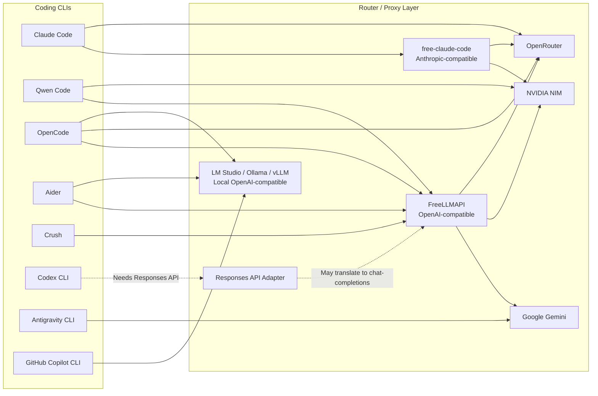

# Tool Map

```mermaid
flowchart LR
  subgraph CLI["Coding CLIs"]
    Claude["Claude Code"]
    Qwen["Qwen Code"]
    OpenCode["OpenCode"]
    Aider["Aider"]
    Crush["Crush"]
    Codex["Codex CLI"]
    AGY["Antigravity CLI"]
    Copilot["GitHub Copilot CLI"]
  end

  subgraph Proxy["Router / Proxy Layer"]
    FCC["free-claude-code<br/>Anthropic-compatible"]
    FLA["FreeLLMAPI<br/>OpenAI-compatible"]
    OR["OpenRouter"]
    NIM["NVIDIA NIM"]
    Gemini["Google Gemini"]
    Resp["Responses API Adapter"]
    Local["LM Studio / Ollama / vLLM<br/>Local OpenAI-compatible"]
  end

  Claude --> FCC
  Claude --> OR
  Qwen --> FLA
  OpenCode --> FLA
  Aider --> FLA
  Crush --> FLA
  Qwen --> NIM
  OpenCode --> OR
  FLA --> Gemini
  FLA --> NIM
  FLA --> OR
  FCC --> NIM
  FCC --> OR
  Codex -. "Needs Responses API" .-> Resp
  Resp -. "May translate to chat-completions" .-> FLA
  AGY --> Gemini
  Copilot --> Local
  OpenCode --> Local
  Aider --> Local
```
